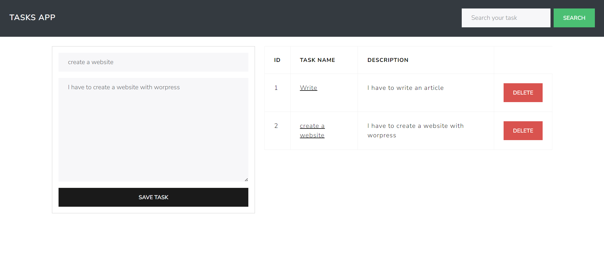

# Tasks-App 📲

### Descripción

Esta app se basa en un sitio web el cual consiste en la administración de tareas personales.

Las funciones con las cumple son:

- 📕 Añadir tareas
- 👀 Ver tareas
- 🗑️ Eliminar tareas
- 📄 Actualizar tareas
- 🔎 Buscar tareas

Este proyecto esta elaborado con JQuery, Bootstrap, PHP, phpMyAdmin y HTML

## Como usar

1. Clonar el repositorio dentro de `htdocs` de **XAMPP** o utilizar algún entorno/herramienta similar
2. Ejecutar el script de la BD dentro de phpMyAdmin en XAMPP
3. Modificar los datos de database.php si fuese necesario
4. Abrir el proyecto con XAMPP a traves de localhost en el navegador. La URL puede ser similar a `http://localhost/Tasks-app/`
5. Listo!

La interfaz que se deberia mostrar es:

> [!NOTE]
> Para actualizar algún dato se debe hacer click en el nombre de la tarea deseada.
